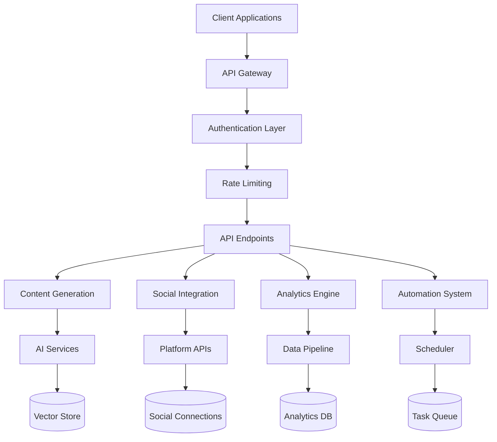

# Lily Media AI - API Documentation

Welcome to the comprehensive API documentation for Lily Media AI, your complete AI-powered social media management platform.

## 📚 Documentation Overview

This documentation provides everything you need to integrate with and build on top of the Lily Media AI platform.

### Quick Navigation

- **[Getting Started](./getting-started.md)** - Your first API calls in 5 minutes
- **[Authentication](./authentication.md)** - Complete authentication and security guide
- **[API Reference](./api-reference.md)** - Complete endpoint documentation
- **[Integration Examples](./examples/)** - Practical code examples and tutorials
- **[Error Handling](./error-handling.md)** - Comprehensive error reference
- **[Rate Limits](./rate-limits.md)** - Rate limiting and quota management
- **[Webhooks](./webhooks.md)** - Event-driven integrations
- **[SDKs and Libraries](./sdks.md)** - Official and community libraries

## 🚀 Quick Start

```bash
# 1. Get your API key from the dashboard
export LILY_API_KEY="your-api-key-here"

# 2. Make your first request
curl -H "Authorization: Bearer $LILY_API_KEY" \
     https://api.lily-media.ai/api/health
```

## 🔑 Key Features

### ✨ AI-Powered Content Generation
- **Text Generation**: GPT-4 powered content creation
- **Image Generation**: xAI Grok-2 Vision image creation
- **Content Optimization**: Platform-specific optimization
- **Brand Consistency**: Style vault and brand guidelines

### 🔗 Social Platform Integration
- **Meta (Facebook/Instagram)**: Complete publishing and analytics
- **Twitter/X**: Tweets, threads, and engagement
- **LinkedIn**: Professional content and company pages
- **TikTok**: Video content and viral optimization

### 📊 Advanced Analytics
- **Performance Tracking**: Comprehensive metrics collection
- **Engagement Analytics**: Deep audience insights
- **Content Performance**: ROI tracking and optimization
- **Competitor Analysis**: Market intelligence

### 🎯 Automation & Scheduling
- **Autonomous Publishing**: AI-driven content scheduling
- **Smart Optimization**: Best-time publishing
- **Content Workflows**: Multi-step automation
- **Plan-Based Features**: Tiered functionality

## 🏗️ Architecture Overview



## 📋 API Principles

### RESTful Design
- **Resource-based URLs**: `/api/posts`, `/api/analytics`
- **HTTP Methods**: GET, POST, PUT, DELETE following semantics
- **Status Codes**: Meaningful HTTP status codes
- **JSON**: Consistent JSON request/response format

### Security First
- **OAuth 2.0**: Industry-standard authentication
- **HTTPS Only**: All communications encrypted
- **Rate Limiting**: Protect against abuse
- **Input Validation**: Comprehensive request validation

### Developer Experience
- **Comprehensive Documentation**: Every endpoint documented
- **Code Examples**: Multiple language examples
- **Interactive Testing**: Built-in API explorer
- **Webhook Support**: Event-driven integrations

## 🔄 API Versioning

The API uses semantic versioning and supports multiple versions:

- **Current Version**: `v2.0.0`
- **Supported Versions**: `v1.x` (deprecated), `v2.x` (current)
- **Version Header**: `Accept: application/vnd.lily-media.v2+json`
- **URL Versioning**: `/api/v2/` (alternative method)

## 📊 Rate Limits & Quotas

Rate limits vary by plan tier:

| Plan | Requests/Hour | Burst | Content Gen/Day | Image Gen/Day |
|------|---------------|-------|-----------------|---------------|
| Free | 1,000 | 50 | 10 | 5 |
| Basic | 5,000 | 100 | 100 | 50 |
| Pro | 20,000 | 500 | 1,000 | 500 |
| Enterprise | Custom | Custom | Custom | Custom |

## 🌐 Base URLs

- **Production**: `https://api.lily-media.ai`
- **Staging**: `https://staging-api.lily-media.ai`
- **Documentation**: `https://docs.lily-media.ai`

## 📞 Support & Community

- **Documentation**: [docs.lily-media.ai](https://docs.lily-media.ai)
- **API Status**: [status.lily-media.ai](https://status.lily-media.ai)
- **Support Email**: api-support@lily-media.ai
- **Community Discord**: [Join our Discord](https://discord.gg/lily-media-ai)
- **GitHub Issues**: [Report bugs and request features](https://github.com/lily-media/api-issues)

## 🔄 Changelog

- **v2.0.0** (2024-09-07): Complete API redesign with plan-based features
- **v1.5.0** (2024-08-15): Added TikTok integration and enhanced analytics
- **v1.4.0** (2024-07-20): Webhook system and real-time notifications
- **v1.3.0** (2024-06-10): OAuth 2.0 implementation and security enhancements

---

**Ready to build amazing social media experiences?** Start with our [Getting Started Guide](./getting-started.md) or jump straight to the [API Reference](./api-reference.md).