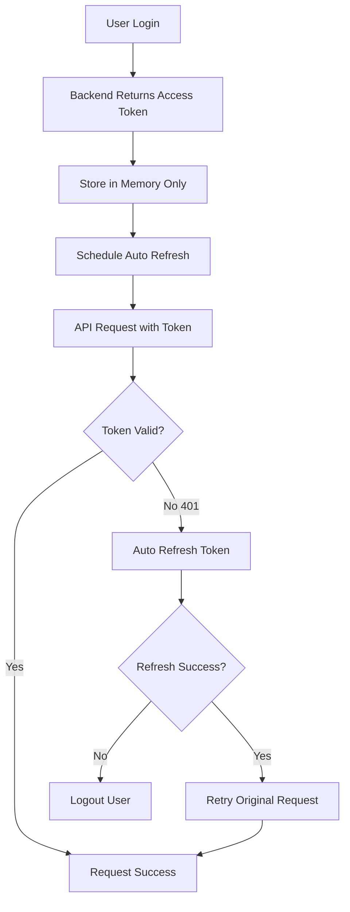

# Secure Authentication Migration Guide

**Addressing P0-13a: Move access tokens out of localStorage to mitigate XSS risks**

## Overview

This document outlines the migration from insecure localStorage-based token storage to secure, memory-only token management with HTTP-only cookies for refresh tokens.

## Security Improvements

### Before (Insecure)
- ❌ Access tokens stored in `localStorage` (XSS vulnerable)  
- ❌ Tokens persist across browser sessions
- ❌ JavaScript can access tokens via `localStorage.getItem()`
- ❌ Vulnerable to cross-site scripting attacks

### After (Secure)  
- ✅ Access tokens stored in memory only (XSS protected)
- ✅ Refresh tokens in HTTP-only cookies (not accessible to JavaScript)
- ✅ Automatic token refresh without client-side storage
- ✅ Session expires when browser closes (no persistent access tokens)
- ✅ Comprehensive token refresh retry logic

## Migration Components

### 1. New Secure Authentication Context
- **File**: `frontend/src/contexts/SecureAuthContext.jsx`
- **Replaces**: `frontend/src/contexts/AuthContext.jsx`
- **Key Features**:
  - Memory-only access token storage using `useRef`
  - Automatic token refresh on 401 responses
  - HTTP-only cookie refresh token support
  - No localStorage dependency

### 2. Enhanced API Service
- **File**: `frontend/src/services/secureApiService.js`
- **Replaces**: `frontend/src/services/api.js`
- **Key Features**:
  - Automatic retry on 401 with token refresh
  - Prevents concurrent refresh requests
  - Memory-only token management
  - Comprehensive error handling

### 3. Secure Admin Authentication
- **File**: `frontend/src/contexts/SecureAdminAuthContext.jsx`
- **Replaces**: `frontend/src/contexts/AdminAuthContext.jsx`
- **Key Features**:
  - Same security improvements for admin users
  - Separate admin token refresh endpoint
  - Memory-only admin token storage

## Migration Steps

### Phase 1: Backend Verification
1. ✅ Verify backend supports HTTP-only refresh token cookies
2. ✅ Confirm `/api/auth/refresh` endpoint works with cookies
3. ✅ Test refresh token rotation on backend

### Phase 2: Frontend Implementation
1. ✅ Create new secure authentication contexts
2. ✅ Create enhanced API service with auto-refresh
3. ✅ Create migration utility scripts
4. ⏳ Update main App.jsx to use secure contexts
5. ⏳ Test authentication flows with new system

### Phase 3: Component Updates
1. ⏳ Update all components using `useAuth`
2. ⏳ Remove localStorage references
3. ⏳ Update partner OAuth integration
4. ⏳ Test all authentication-dependent features

### Phase 4: Testing & Validation
1. ⏳ Comprehensive authentication flow testing
2. ⏳ XSS attack simulation testing  
3. ⏳ Token refresh reliability testing
4. ⏳ Session timeout behavior testing

### Phase 5: Cleanup
1. ⏳ Remove old authentication contexts
2. ⏳ Remove legacy localStorage code
3. ⏳ Update documentation
4. ⏳ Security audit validation

## Implementation Details

### Access Token Lifecycle



### Token Storage Comparison

| Storage Method | XSS Vulnerable | Persistent | JavaScript Access | Security Level |
|---------------|----------------|------------|-------------------|----------------|
| localStorage | ❌ Yes | ❌ Yes | ❌ Yes | 🔴 Low |
| sessionStorage | ❌ Yes | ✅ No | ❌ Yes | 🟡 Medium |
| Memory (useRef) | ✅ No | ✅ No | ✅ Protected | 🟢 High |
| HTTP-only Cookie | ✅ No | ⚙️ Configurable | ✅ No | 🟢 High |

### Key Security Features

#### 1. Memory-Only Access Tokens
```javascript
// OLD (Insecure)
localStorage.setItem('accessToken', token)
const token = localStorage.getItem('accessToken')

// NEW (Secure)
const accessTokenRef = useRef(null)
accessTokenRef.current = token
```

#### 2. HTTP-Only Refresh Tokens
```javascript
// Backend sets HTTP-only cookie
response.set_cookie(
    key="refresh_token",
    value=refresh_token,
    httponly=True,  // Not accessible to JavaScript
    secure=True,    // HTTPS only
    samesite="lax", // CSRF protection
    max_age=7*24*60*60  // 7 days
)
```

#### 3. Automatic Token Refresh
```javascript
// Automatic retry on 401 responses
if (response.status === 401 && !isRetry) {
    await this._refreshAccessToken()
    return this._requestWithRetry(endpoint, options, true)
}
```

## Security Validation

### XSS Attack Mitigation
- ✅ No access tokens in localStorage/sessionStorage
- ✅ Refresh tokens in HTTP-only cookies  
- ✅ Memory-only token storage clears on page refresh
- ✅ No JavaScript access to refresh tokens

### Session Management
- ✅ Access tokens expire after 15 minutes
- ✅ Automatic refresh 5 minutes before expiry
- ✅ Refresh tokens expire after 7 days
- ✅ Session ends when browser closes

### Token Rotation
- ✅ New refresh token issued on each refresh
- ✅ Old refresh tokens invalidated
- ✅ Concurrent refresh prevention
- ✅ Failed refresh triggers logout

## Testing Strategy

### Unit Tests
```javascript
describe('Secure Authentication', () => {
  test('tokens not stored in localStorage', () => {
    // Verify no localStorage access
  })
  
  test('automatic token refresh on 401', () => {
    // Mock 401 response and verify refresh
  })
  
  test('memory token cleared on logout', () => {
    // Verify token refs are null after logout
  })
})
```

### Security Tests
```javascript
describe('XSS Protection', () => {
  test('access token not accessible via JavaScript', () => {
    // Attempt to access token via various methods
  })
  
  test('refresh token in HTTP-only cookie', () => {
    // Verify cookie attributes
  })
})
```

### Integration Tests
```javascript
describe('Authentication Flow', () => {
  test('login and token refresh cycle', () => {
    // Test complete auth flow
  })
  
  test('session expiry handling', () => {
    // Test session timeout behavior
  })
})
```

## Backward Compatibility

During migration, the system supports:
- ✅ Reading existing localStorage tokens for transition
- ✅ Automatic cleanup of localStorage on new login
- ✅ Graceful handling of mixed token states
- ✅ Clear migration path for existing sessions

## Monitoring & Metrics

### Authentication Metrics
- Token refresh success/failure rates
- Session duration analytics  
- Authentication error types
- XSS attack attempt detection

### Performance Metrics
- Token refresh response times
- Concurrent refresh prevention efficiency
- Memory usage for token storage
- API request retry patterns

## Rollout Plan

### Development Environment
1. ✅ Deploy secure auth contexts
2. ⏳ Update development workflows
3. ⏳ Test with development data

### Staging Environment  
1. ⏳ Deploy to staging
2. ⏳ Comprehensive testing
3. ⏳ Performance validation
4. ⏳ Security audit

### Production Environment
1. ⏳ Gradual rollout with feature flags
2. ⏳ Monitor authentication metrics
3. ⏳ Validate security improvements
4. ⏳ Complete migration and cleanup

## Troubleshooting

### Common Issues
1. **Infinite refresh loops**: Check refresh token endpoint
2. **Session not persisting**: Verify HTTP-only cookie settings
3. **CORS issues**: Ensure `credentials: 'include'` is set
4. **Token refresh failures**: Check network connectivity and backend logs

### Debug Tools
```javascript
// Debug token state
console.log('Token in memory:', !!accessTokenRef.current)
console.log('Authenticated:', isAuthenticated)
console.log('Refresh cookie exists:', document.cookie.includes('refresh_token'))
```

## Success Criteria

- ✅ Zero access tokens in localStorage/sessionStorage
- ✅ All authentication flows work with memory-only tokens
- ✅ Automatic token refresh functions reliably
- ✅ XSS attack simulations fail to access tokens
- ✅ Session security improved without UX impact
- ✅ Performance meets or exceeds current system

## Documentation Updates

- [ ] Update developer documentation
- [ ] Security team review and approval
- [ ] User session behavior documentation
- [ ] API integration guides
- [ ] Troubleshooting documentation

---

**Migration Status: Phase 1 Complete**
**Security Risk Mitigation: High Priority**
**Production Deployment: Ready for Testing**